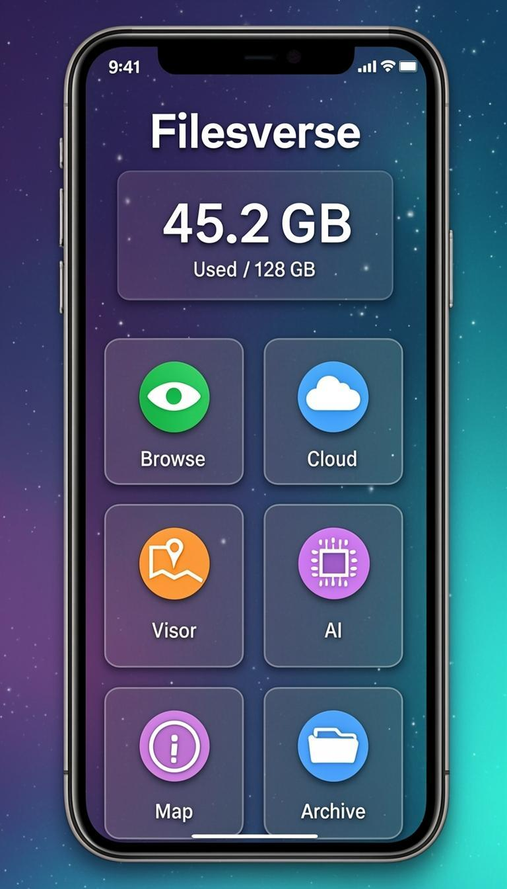
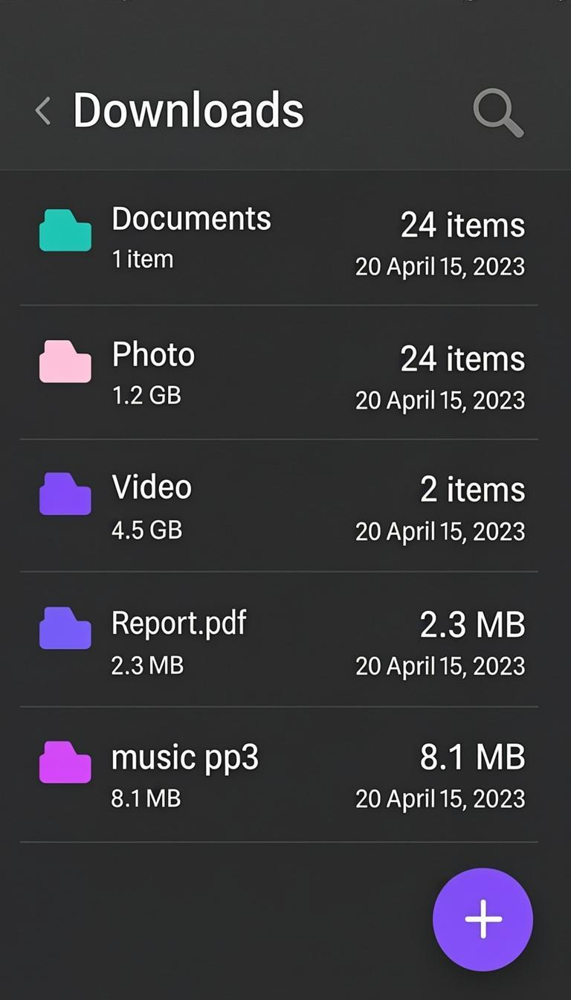
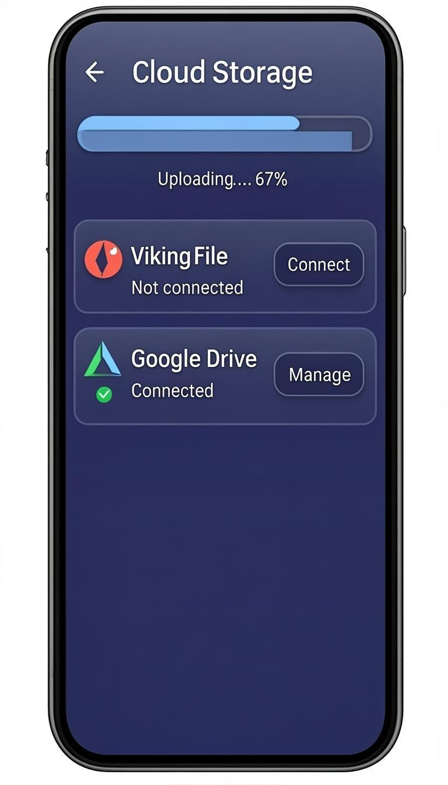
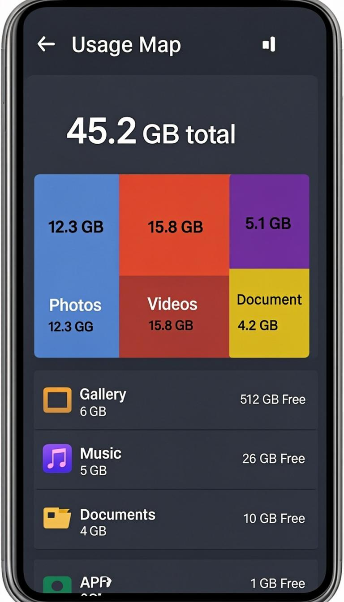
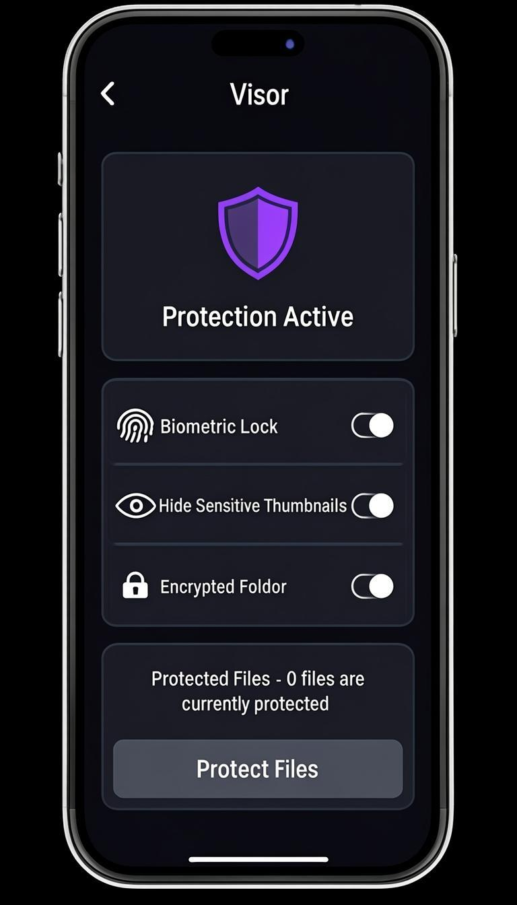
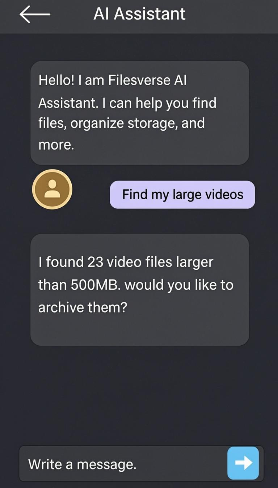
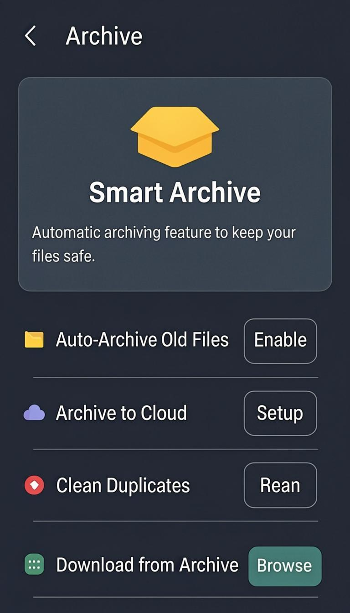
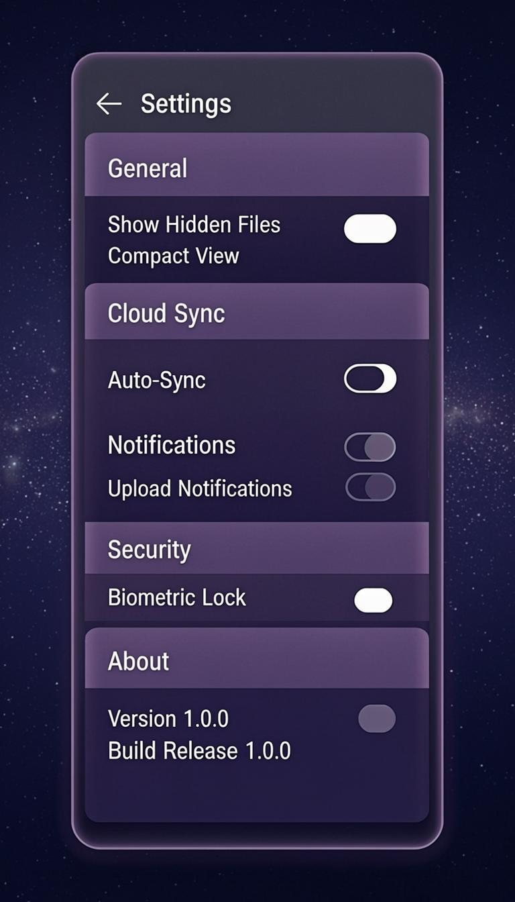

<p align="center">
  
</p>

<h1 align="center">Filesverse</h1>

<p align="center">
  <strong>The Next-Generation Intelligent File Manager for Android</strong>
</p>

<p align="center">
  <a href="https://github.com/nicktrix/Filesverse/releases"></a>
  <a href="https://github.com/nicktrix/Filesverse/actions"></a>
  <a href="LICENSE"></a>
  <a href="https://f-droid.org/packages/com.filesverse.app/"></a>
</p>

---

## Overview

Filesverse reimagines file management on Android with a beautiful dark-themed interface, AI-powered search, multi-cloud integration, and military-grade privacy features. Built with Kotlin and Jetpack Compose, it delivers a modern, fluid experience that adapts to how you actually use your files.

## Features

### Intelligent File Management
- **Context-Based UI** — The interface adapts based on your current context (work, media, documents), surfacing the most relevant actions and files automatically
- **AI Assistant** — Natural language search and file organization. Ask "find photos from last weekend" or "show large files"
- **Smart Search** — Deep file search across your entire device with instant results

### Usage Analytics
- **Storage Map** — Beautiful visual breakdown of storage usage by file type with interactive charts
- **Duplicate Detection** — Find and remove duplicate files to reclaim valuable space
- **Storage Insights** — Smart recommendations for freeing up space

### Privacy & Security (Visor)
- **Biometric Protection** — Lock sensitive files behind fingerprint or face recognition
- **Hidden Thumbnails** — Conceal thumbnails of protected media files from the gallery
- **Encrypted Vault** — Auto-encrypt files placed in the secure vault folder

### Cloud Integration
- **VikingFile** — Upload and share files directly to VikingFile.com with progress tracking
- **Google Drive** — Full Google Drive integration with upload, download, and sync
- **Multi-Cloud** — Support for Dropbox, OneDrive, MEGA, Yandex.Disk, and more

### Archive System
- **Smart Archive** — Auto-archive files older than 90 days to free up space
- **Cloud Archive** — Move infrequently used files to cloud storage automatically
- **One-Tap Restore** — Quickly restore archived files back to your device

### Design
- **Dark Theme** — Gorgeous cosmic dark theme with purple-cyan gradients
- **Material You** — Fully embraces Material Design 3 guidelines
- **Smooth Animations** — Fluid transitions and micro-interactions throughout

## Screenshots

| Home | File Browser | Cloud Upload | Usage Map |
|------|-------------|-------------|-----------|
|  |  |  |  |

| Visor | AI Assistant | Archive | Settings |
|-------|-------------|---------|----------|
|  |  |  |  |

## Tech Stack

- **Language**: Kotlin 2.1
- **UI Framework**: Jetpack Compose with Material 3
- **Architecture**: MVVM + Clean Architecture
- **Dependency Injection**: Hilt / Dagger
- **Networking**: OkHttp + Retrofit
- **Image Loading**: Coil
- **Database**: Room
- **Coroutines**: Kotlin Coroutines + Flow
- **Build System**: Gradle with Kotlin DSL
- **Min SDK**: 26 (Android 8.0)
- **Target SDK**: 35 (Android 15)

## Building

### Prerequisites
- Android Studio Hedgehog or newer
- JDK 17
- Android SDK with API 35

### Build from Source

```bash
# Clone the repository
git clone https://github.com/nicktrix/Filesverse.git
cd Filesverse

# Build debug APK
./gradlew assembleDebug

# Build release APK (requires signing configuration)
./gradlew assembleRelease
```

## Installation

### Download APK
Download the latest release APK from the [Releases](https://github.com/nicktrix/Filesverse/releases) page.

### F-Droid
Install from F-Droid: [Filesverse on F-Droid](https://f-droid.org/packages/com.filesverse.app/)

## Project Structure

```
app/src/main/java/com/filesverse/app/
├── FilesverseApp.kt          # Application class
├── MainActivity.kt            # Main entry point
├── data/
│   ├── model/                 # Data models (FileItem, CloudAccount)
│   └── repository/            # Data repositories (File, Cloud)
├── service/                   # External services (VikingFile, Google Drive)
├── ui/
│   ├── theme/                 # Theme, Colors, Typography
│   ├── screens/               # Compose screens
│   ├── components/            # Reusable UI components
│   └── navigation/            # Navigation graph
└── viewmodel/                 # ViewModels
```

## Contributing

1. Fork the repository
2. Create your feature branch (`git checkout -b feature/amazing-feature`)
3. Commit your changes (`git commit -m 'Add amazing feature'`)
4. Push to the branch (`git push origin feature/amazing-feature`)
5. Open a Pull Request

## License

This project is licensed under the GNU General Public License v3.0 - see the [LICENSE](LICENSE) file for details.
